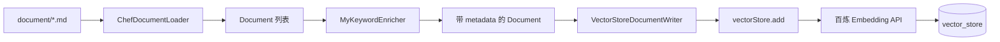
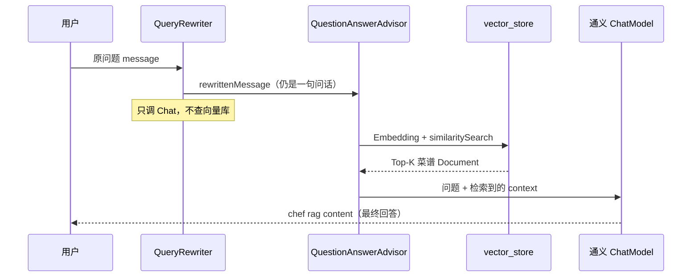

# 百味智厨 · RAG 流程说明

> 本文说明 RAG（Retrieval-Augmented Generation，检索增强生成）在本项目中的**完整链路**：用了哪些组件、metadata 从哪来、哪一行代码写入向量库、问答时 QueryRewriter 与 QuestionAnswerAdvisor 各做什么。  
> 与 [`业务流程说明.md`](./业务流程说明.md)（登录/会话/chat_message）互补；与 [`代码架构与类关系说明.md`](./代码架构与类关系说明.md)（类图/Bean 依赖）互补。

---

## 1. RAG 解决什么问题？

大模型（通义 qwen-plus）**不知道**项目私有的菜谱 Markdown。直接问「减脂晚餐怎么搭配」可能瞎编。

**做法：**

1. **入库阶段**：Markdown → 切块 → 元数据增强 → Embedding → 存入 `vector_store`
2. **问答阶段**：用户问题 →（可选）查询重写 → 向量检索 → 把菜谱片段塞进 Prompt → 大模型生成答案

---

## 2. 两张表不要混（常见困惑）

| 表 | 用途 | 谁写 | 谁读 |
|----|------|------|------|
| `chat_message` | 多轮**对话记忆**（user/assistant 历史） | `PostgreSqlChatMemoryRepository` | `MessageChatMemoryAdvisor` |
| `vector_store` | **菜谱知识库向量**（RAG 专用） | `PgVectorStore.add()` | `QuestionAnswerAdvisor` 检索 |

普通 SSE 聊天 **不走 RAG**；`doChatWithRag` 才用 `vector_store`。

---

## 3. 技术栈一览

| 层次 | 组件 | 作用 |
|------|------|------|
| 框架 | Spring Boot 3.4 + Spring AI 1.1 | ChatClient、Advisor、VectorStore |
| 对话 / 关键词 / 查询重写 | 百炼 `ChatModel`（qwen-plus） | 关键词提取、QueryRewriter、最终生成 |
| 向量化 | 百炼 `EmbeddingModel`（Starter 自动注册） | `vectorStore.add` / 检索时内部调用，**业务代码不手写 HTTP** |
| 文档读取 | `MarkdownDocumentReader` | 读 `classpath:document/*.md` |
| 元数据增强 | `KeywordMetadataEnricher` | 为每段文档补 `excerpt_keywords` |
| 向量库 | `PgVectorStore` + PostgreSQL pgvector | 表 `vector_store`，1024 维，HNSW + 余弦距离 |
| 检索问答 | `QuestionAnswerAdvisor` | 自动：问题 Embedding → 相似检索 → 注入上下文 |
| 查询优化 | `RewriteQueryTransformer` | 口语问题改写成更利于检索的 query（可选） |
| 分批写入 | `VectorStoreDocumentWriter` | 每批 ≤10 条（百炼 Embedding batch 上限） |

---

## 4. 入库流程（Indexing）



### 4.1 `ChefDocumentLoader` — 加载并切块

- 扫描 `src/main/resources/document/*.md`
- `MarkdownDocumentReader` 按 Markdown 结构（如 `####` 标题）切成多个 `Document`
- **此时 metadata 已有：**
  - `title`：来自小节标题（如「只有面条和鸡蛋能做什么？」）
  - `filename`：如 `家常菜谱知识库 - 快手篇.md`
  - `category`：从文件名截取（如「快手」「健康」）
- **content**：标题下的正文（如「推荐「鸡蛋拌面」：煮面过凉…」）

### 4.2 `MyKeywordEnricher` — 元数据增强（不是 Embedding）

```java
KeywordMetadataEnricher keywordMetadataEnricher = new KeywordMetadataEnricher(dashscopeChatModel, 5);
return keywordMetadataEnricher.apply(documents);
```

- 使用 **Chat 模型**（不是 Embedding）阅读每段 `content`
- **只新增** metadata 字段：`excerpt_keywords`（约 5 个关键词）
- **不会**把整段文档「转成 JSON」；JSON 是入库时 metadata 列的序列化结果

**metadata 示例（入库后 `vector_store.metadata` 列）：**

```json
{
  "title": "只有面条和鸡蛋能做什么？",
  "category": "快手",
  "filename": "家常菜谱知识库 - 快手篇.md",
  "excerpt_keywords": "鸡蛋拌面, 番茄鸡蛋面, 快手家常面, 凉拌面酱汁, 15分钟速食"
}
```

| 字段 | 来源 |
|------|------|
| `title` | `MarkdownDocumentReader` |
| `filename` / `category` | `ChefDocumentLoader.withAdditionalMetadata` |
| `excerpt_keywords` | `KeywordMetadataEnricher` |

### 4.3 真正写入向量库的代码

**业务侧入口（分批）：**

```java
// VectorStoreDocumentWriter.java
vectorStore.add(batch);
```

**调用链：**

- 启动：`ChefVectorStoreConfig` → `vectorStoreDocumentWriter.addInBatches(vectorStore, enrichedDocuments)`
- 测试：`ChefRagPipelineTest.loadDocumentsIntoPgVector()` → 同上

**`vectorStore.add()` 内部（Spring AI `PgVectorStore`，框架实现）：**

1. 对每段 `Document` 的 **content 正文** 调用 `EmbeddingModel` → 1024 维向量
2. `INSERT INTO vector_store (id, content, metadata, embedding) VALUES (...)`

| 数据库列 | 对应 |
|----------|------|
| `content` | `Document.getText()` |
| `metadata` | `Document.getMetadata()` → JSONB |
| `embedding` | 对 **content** 向量化（检索用） |

### 4.4 `ChefVectorStoreConfig` 要点

- Bean 名：`chefVectorStore`（`PgVectorStore`）
- `.dimensions(1024)`：与百炼默认向量长度一致
- `rag.initialize-on-empty: true`：表非空则跳过启动导入
- `rag.skip-startup-load: true`：测试环境跳过，由测试自己灌库
- `rag.embedding-batch-size: 10`：写入时每批最多 10 条

### 4.5 删表 / 重建（维度变更时）

```sql
CREATE EXTENSION IF NOT EXISTS vector;
DROP TABLE IF EXISTS vector_store CASCADE;
-- 之后启动应用或跑测试，initializeSchema 会按 1024 维建表
```

详见 [`sql/README.md`](../sql/README.md)。

---

## 5. 问答流程（Retrieval + Generation）

入口：`ChefApp.doChatWithRag(message, chatId)`  
HTTP：`GET /api/ai/chef_app/chat/rag`（前端当前未接，可用 Postman / 测试）

```java
String rewrittenMessage = queryRewriter.doQueryRewrite(message);
ChatResponse chatResponse = chatClient
        .prompt()
        .user(rewrittenMessage)
        .advisors(spec -> spec.param(ChatMemory.CONVERSATION_ID, chatId))
        .advisors(new MyLoggerAdvisor())
        .advisors(QuestionAnswerAdvisor.builder(chefVectorStore).build())
        .call()
        .chatResponse();
```



### 5.1 `QueryRewriter` — 检索**前**改问法

- `RewriteQueryTransformer` + Chat 模型
- 输出：**改写后的 query 文本**，放入 `.user(rewrittenMessage)`
- **不**检索向量库，**不**把菜谱塞进 user 消息
- 对已经很清晰的问题（如「低卡路里减脂晚餐有什么推荐？」）可能几乎不变；可视为可选优化，省延迟可去掉

### 5.2 `QuestionAnswerAdvisor` — RAG 的核心

- 在 `call()` 时自动执行：
  1. 对用户消息做 Embedding
  2. `chefVectorStore.similaritySearch(...)`
  3. 把检索到的菜谱片段拼进 Prompt（上下文增强）
  4. 再调 Chat 模型生成
- 日志里的 `chef rag content: 推荐3款低卡路里…` 是**模型最终回答**，不是 QueryRewriter 的输出

### 5.3 `.param(ChatMemory.CONVERSATION_ID, chatId)` — 多轮记忆

- 告诉 `MessageChatMemoryAdvisor`（ChatClient 默认 Advisor）用哪个会话 ID
- 从 `chat_message` 读/写该会话最近 **20 条**消息
- 与 RAG 向量检索无关；测试里若每次随机 `chatId`，则相当于无历史

---

## 6. 三个常见误解

| 误解 | 正解 |
|------|------|
| QueryRewriter 的输出就是 `chef rag content` | 改写输出仍是**问句**；长回答是 ChatModel 在检索增强后生成的 |
| QueryRewriter 已经做了向量检索 | 检索是 **QuestionAnswerAdvisor** 做的 |
| KeywordMetadataEnricher 生成整段 metadata JSON | 只补 `excerpt_keywords`；`title/category/filename` 来自 DocumentLoader |

---

## 7. 测试怎么跑

```bash
# 仅检查 PgVector Bean / 表（不调 embedding）
mvn test -Dtest=PgVectorStoreTest

# 全流程：灌库 → doChatWithRag
mvn test -Dtest=ChefRagPipelineTest#fullRagPipeline_inOneTest
```

`ChefRagPipelineTest` 每测前 `TRUNCATE vector_store`，并在测试内显式执行：加载 → 增强 → `addInBatches` → `doChatWithRag`。

---

## 8. 相关源码路径

| 类 | 路径 |
|----|------|
| `ChefDocumentLoader` | `src/main/java/com/wu/aiagent/rag/ChefDocumentLoader.java` |
| `MyKeywordEnricher` | `src/main/java/com/wu/aiagent/rag/MyKeywordEnricher.java` |
| `VectorStoreDocumentWriter` | `src/main/java/com/wu/aiagent/rag/VectorStoreDocumentWriter.java` |
| `ChefVectorStoreConfig` | `src/main/java/com/wu/aiagent/rag/ChefVectorStoreConfig.java` |
| `QueryRewriter` | `src/main/java/com/wu/aiagent/rag/QueryRewriter.java` |
| `ChefApp.doChatWithRag` | `src/main/java/com/wu/aiagent/app/ChefApp.java` |
| 集成测试 | `src/test/java/com/wu/aiagent/rag/ChefRagPipelineTest.java` |
| 菜谱原文 | `src/main/resources/document/*.md` |
