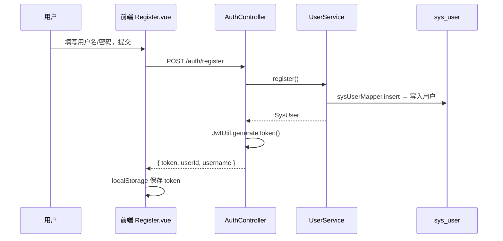
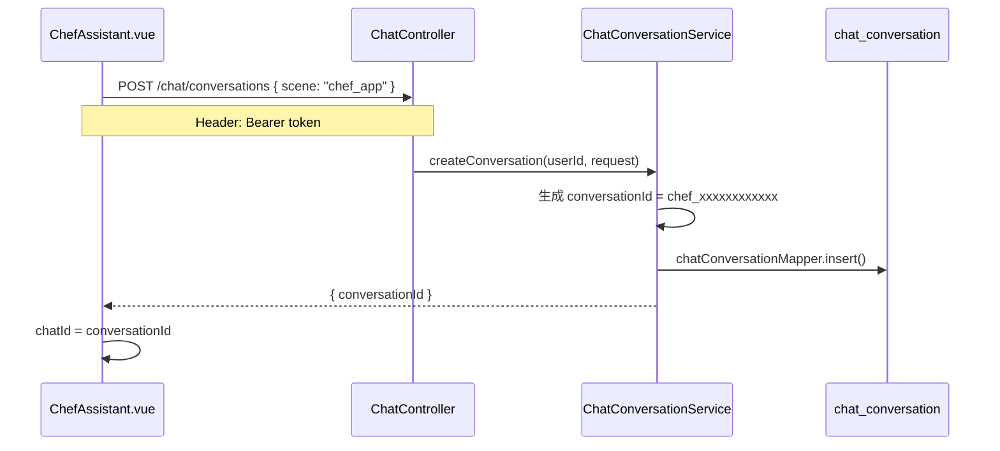
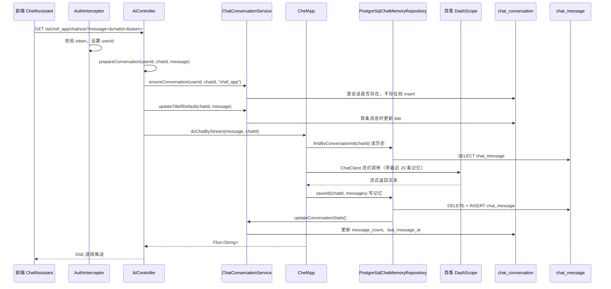

# 百味智厨 · 业务流程说明

> 本文说明：**从前端用户操作开始，到后端各层如何处理，再到 PostgreSQL 落库** 的完整链路。  
> 重点解释：登录、建会话、发消息、对话记忆持久化分别由谁负责、写哪张表。

---

## 1. 项目业务概览

百味智厨是一个 **AI 烹饪助手**，当前核心业务流程：

1. 用户 **注册 / 登录**，身份写入 `sys_user`
2. 用户进入 **烹饪助手**，创建一条 **会话**（`chat_conversation`）
3. 用户 **发送消息**，后端调用大模型生成回复
4. 对话内容 **持久化** 到 `chat_message`，刷新页面可恢复历史
5. （可选）智厨智能体 `ChefManus` 走 ReAct 多步推理，与会话表关联但 AI 核心类不同

**数据表分工：**

| 表 | 存什么 | 谁负责写 |
|----|--------|----------|
| `sys_user` | 账号、密码哈希 | `UserService` |
| `chat_conversation` | 会话元数据（归属用户、标题、消息数、最后活跃时间） | `ChatConversationService` |
| `chat_message` | 每条 user / assistant 对话内容（AI 上下文记忆） | `PostgreSqlChatMemoryRepository`（由 `ChefApp` 间接触发） |
| `vector_store` | RAG 菜谱向量（与聊天内容无关） | `PgVectorStore.add()`（见 [`RAG流程说明.md`](./RAG流程说明.md)） |

> RAG 完整流程（入库 / 问答 / metadata / Advisor）见 **[`docs/RAG流程说明.md`](./RAG流程说明.md)**。

---

## 2. 系统分层（从前端到数据库）

```text
┌─────────────────────────────────────────────────────────────┐
│  前端 Vue3 (localhost:3000)                                  │
│  Login / Register / ChefAssistant / ChefManus               │
└───────────────────────────┬─────────────────────────────────┘
                            │ HTTP / SSE
                            ▼
┌─────────────────────────────────────────────────────────────┐
│  拦截器 AuthInterceptor                                      │
│  校验 JWT → 得到 userId                                      │
└───────────────────────────┬─────────────────────────────────┘
                            ▼
┌─────────────────────────────────────────────────────────────┐
│  Controller 层                                               │
│  AuthController  │  ChatController  │  AiController          │
└───────────────────────────┬─────────────────────────────────┘
                            ▼
┌─────────────────────────────────────────────────────────────┐
│  Service 层                                                  │
│  UserService  │  ChatConversationService                     │
└───────────────────────────┬─────────────────────────────────┘
                            ▼
┌─────────────────────────────────────────────────────────────┐
│  AI 核心                                                     │
│  ChefApp（烹饪助手）│  ChefManus（智能体）                     │
└───────────────────────────┬─────────────────────────────────┘
                            ▼
┌─────────────────────────────────────────────────────────────┐
│  Spring AI                                                   │
│  ChatClient + MessageChatMemoryAdvisor + DashScope 百炼      │
└───────────────────────────┬─────────────────────────────────┘
                            ▼
┌─────────────────────────────────────────────────────────────┐
│  记忆持久化                                                  │
│  PostgreSqlChatMemoryRepository → chat_message               │
└───────────────────────────┬─────────────────────────────────┘
                            ▼
                     PostgreSQL (mydb)
```

---

## 3. 前端页面与后端接口对照

| 前端页面 | 路径 | 主要调用的后端接口 |
|----------|------|-------------------|
| 注册 | `/register` | `POST /api/auth/register` |
| 登录 | `/login` | `POST /api/auth/login` |
| 首页 | `/` | 无（展示入口，可退出登录） |
| 烹饪助手 | `/chef-assistant` | `POST /api/chat/conversations`<br>`GET /api/chat/conversations/{id}/messages`<br>`GET /api/ai/chef_app/chat/sse` |
| 智厨智能体 | `/chef-manus` | `POST /api/chat/conversations`<br>`GET /api/ai/chef_manus/chat` |

**认证方式：**

- 普通请求（axios）：Header `Authorization: Bearer {token}`
- SSE 流式（EventSource 无法带 Header）：URL 参数 `?token={token}`

**后端端口：** `http://localhost:8123/api`（context-path 为 `/api`）

---

## 4. 流程一：用户注册与登录

### 4.1 注册



**代码路径：**

- 前端：`wu-ai-agent-frontend/src/views/Register.vue` → `api/index.js` → `register()`
- 后端：`AuthController.register()` → `UserService.register()` → `sysUserMapper.insert()`

**落库表：** `sys_user`（用户名、BCrypt 密码哈希、邮箱等）

### 4.2 登录

与注册类似，调用 `POST /api/auth/login`：

- `UserService.login()` 校验用户名密码
- 成功后签发 JWT，前端保存 token
- **不经过 `ChefApp`**

---

## 5. 流程二：进入烹饪助手（建会话 + 加载历史）

用户登录后访问 `/chef-assistant`，页面 `onMounted` 执行 `initConversation()`。

### 5.1 创建会话



**说明：**

- 这里的 `conversationId` 就是接口里常说的 **`chatId`**
- 此时只写 **会话元数据**，还没有 user/assistant 消息
- **不经过 `ChefApp`**

**`createConversation` 写入的字段示例：**

| 字段 | 含义 |
|------|------|
| `conversation_id` | 如 `chef_a1b2c3d4e5f6` |
| `user_id` | 当前登录用户 ID |
| `scene` | `chef_app` |
| `title` | 默认「新对话」 |
| `message_count` | 0 |

### 5.2 加载历史消息

```text
GET /api/chat/conversations/{conversationId}/messages
  → ChatController.listMessages()
  → ChatConversationService.listMessages()
  → chatMessageMapper.selectList()   // 读 chat_message 表
```

- 若数据库里还没有消息，前端显示一条本地欢迎语（不调 AI）
- **不经过 `ChefApp`**

---

## 6. 流程三：用户发送消息（核心对话流程）

这是最重要的链路：**前端发一条消息 → 后端 AI 回复 → 对话写入数据库**。

### 6.1 总览时序图



### 6.2 第一步：AiController 收到请求

**接口：**

```text
GET /api/ai/chef_app/chat/sse?message=番茄炒蛋怎么做&chatId=chef_xxx&token=eyJ...
```

**代码：** `AiController.doChatSSE()`

```java
prepareConversation(userId, chatId, message);
return chefApp.doChatByStream(message, chatId);
```

### 6.3 第二步：prepareConversation —— 会话「元数据」落库

`prepareConversation` 在 **调 AI 之前** 执行，负责 **会话表** 的业务，**不负责保存具体聊天内容**。

```java
private void prepareConversation(Long userId, String chatId, String message) {
    chatConversationService.ensureConversation(userId, chatId, SCENE_CHEF_APP);
    chatConversationService.updateTitleIfDefault(chatId, message);
}
```

#### 6.3.1 ensureConversation —— 确保会话存在且属于当前用户

**代码：** `ChatConversationService.ensureConversation()`

**逻辑：**

1. 按 `conversation_id`（即 `chatId`）查询 `chat_conversation`
2. **若不存在** → `chatConversationMapper.insert(created)` 新建一条会话
3. **若已存在** → 校验 `user_id` 是否等于当前用户，否则 403

```java
if (conversation == null) {
    // 补建会话（兜底：例如前端未先调 createConversation 就直接发消息）
    chatConversationMapper.insert(created);
    return;
}
if (!userId.equals(conversation.getUserId())) {
    throw new BusinessException(403, "无权访问该会话");
}
```

> **注意：** 正常流程下，进入烹饪助手时已通过 `POST /chat/conversations` 建过会话；  
> `ensureConversation` 是 **发消息前的二次保障**，并防止用户访问别人的 `chatId`。

#### 6.3.2 updateTitleIfDefault —— 用首条消息更新会话标题

若标题仍是默认「新对话」，则截取用户消息前 20 字作为 `title`，更新 `chat_conversation`。

**此时仍不写 `chat_message`，只更新会话表。**

### 6.4 第四步：ChefApp.doChatByStream —— AI 对话核心

**会调用 `ChefApp`**，方法是 `doChatByStream(message, chatId)`。

内部通过 Spring AI 的 `ChatClient`：

1. `MessageChatMemoryAdvisor` 按 `chatId` 加载多轮上下文
2. 调用百炼大模型流式生成
3. 对话结束后更新 ChatMemory

**ChefApp 构造时已注入 PostgreSQL 版记忆：**

```java
public ChefApp(..., MessageWindowChatMemory messageWindowChatMemory) {
    // messageWindowChatMemory 底层是 PostgreSqlChatMemoryRepository
}
```

### 6.5 第五步：PostgreSqlChatMemoryRepository —— 聊天内容落库

**这才是「用户说了什么、AI 回了什么」写入 `chat_message` 的地方。**

由 Spring AI 的 `MessageWindowChatMemory` 自动调用，开发者不直接在 Controller 里写 SQL。

| 方法 | 作用 |
|------|------|
| `findByConversationId(chatId)` | 从 `chat_message` **读取**历史，供大模型做上下文 |
| `saveAll(chatId, messages)` | **全量替换**该会话在窗口内的消息（最多 20 条） |

**`saveAll` 内部流程：**

```java
chatMessageMapper.physicalDeleteByConversationId(conversationId);  // 删掉旧窗口
for (Message message : messages) {
    chatMessageMapper.insert(entity);   // 插入 user / assistant 消息
}
chatConversationService.updateConversationStats(conversationId, messages.size());
```

**落库表：** `chat_message`

| 字段 | 示例 |
|------|------|
| `conversation_id` | `chef_xxx`（同 chatId） |
| `role` | `user` / `assistant` |
| `content` | 消息正文 |

同时 **`updateConversationStats`** 会更新 `chat_conversation` 的：

- `message_count`：当前记忆窗口内消息条数
- `last_message_at`：最后一条消息时间

---

## 7. 两张「会话相关」表的区别（重要）

很多人会把 `chat_conversation` 和 `chat_message` 混在一起，其实分工明确：

| | chat_conversation | chat_message |
|--|-------------------|--------------|
| **存什么** | 会话「档案」：谁的用户、什么场景、标题、消息数、最后活跃 | 具体聊天内容：user 说了啥、assistant 回了啥 |
| **何时写** | 进页面建会话；发消息前 `ensureConversation`；AI 回复后更新统计 | AI 对话过程中 ChatMemory 自动 `saveAll` |
| **谁写** | `ChatConversationService` | `PostgreSqlChatMemoryRepository` |
| **是否经过 ChefApp** | 否（AiController → Service） | 是（ChefApp → ChatMemory → Repository） |

**简单记：**

- **`ensureConversation` + `insert`** → 保证「这条会话属于这个用户」→ `chat_conversation`
- **`ChefApp` + `saveAll`** → 保存「聊了什么」→ `chat_message`

---

## 8. 流程四：刷新页面后如何看到历史

```text
1. 用户再次进入 /chef-assistant（仍用同一 token）
2. POST /chat/conversations → 会创建【新】会话（当前实现每次进页新建）
3. GET /chat/conversations/{id}/messages → 读 chat_message 显示历史
```

> 说明：当前前端每次进入烹饪助手都会 `createConversation` 新建 `chatId`。  
> 若希望「继续上一次会话」，需改为：进入时调 `GET /chat/conversations` 选最近一条，或本地缓存 `chatId`（后续可扩展）。

刷新 **同一会话 id** 的页面时：

- `fetchMessages(chatId)` 从 `chat_message` 读出之前 `ChefApp` 持久化的 user/assistant 记录

---

## 9. 智厨智能体（ChefManus）差异

| 对比项 | 烹饪助手 | 智厨智能体 |
|--------|----------|------------|
| 前端页面 | `ChefAssistant.vue` | `ChefManus.vue` |
| 对话接口 | `/ai/chef_app/chat/sse` | `/ai/chef_manus/chat` |
| AI 核心类 | **`ChefApp`** | **`ChefManus`**（不是 ChefApp） |
| 会话 scene | `chef_app` | `chef_manus` |
| 消息持久化 | ✅ 经 ChatMemory 写 `chat_message` | ⚠️ 目前 mainly 建会话记录，Manus 逐步消息未完全接入 ChatMemory |

---

## 10. 后端类职责速查

| 类 | 职责 |
|----|------|
| `AuthController` | 注册、登录、当前用户 |
| `ChatController` | 创建会话、会话列表、历史消息查询 |
| `AiController` | AI 对话 HTTP 入口；发消息前 `prepareConversation` |
| `UserService` | 用户注册登录，`sys_user` CRUD |
| `ChatConversationService` | 会话元数据：`createConversation`、`ensureConversation`、统计、标题 |
| `ChefApp` | 烹饪助手 AI：ChatClient、RAG/Tools/MCP 等 |
| `PostgreSqlChatMemoryRepository` | Spring AI 记忆接口实现，读写 `chat_message` |
| `ChatMemoryConfig` | 配置 `MessageWindowChatMemory`（窗口 20 条 + PG 持久化） |
| `AuthInterceptor` | JWT 校验，`/ai/**`、`/chat/**` 需登录 |

---

## 11. ChefApp 各方法与前端的对应关系

| ChefApp 方法 | 后端接口 | 前端是否使用 |
|--------------|----------|--------------|
| `doChatByStream` | `GET /ai/chef_app/chat/sse` | ✅ 烹饪助手默认使用 |
| `doChat` | `GET /ai/chef_app/chat/sync` | ❌ |
| `doChatWithRag` | `GET /ai/chef_app/chat/rag` | ❌ |
| `doChatWithTools` | `GET /ai/chef_app/chat/tools` | ❌ |
| `doChatWithMcp` | `GET /ai/chef_app/chat/mcp` | ❌ |
| `doChatWithReport` | `GET /ai/chef_app/chat/report` | ❌ |

---

## 12. 一次完整对话的数据流小结

以用户登录后问「番茄炒蛋怎么做」为例：

```text
1. POST /auth/login
   → sys_user 校验通过，返回 token

2. POST /chat/conversations
   → chat_conversation 新增一行（conversation_id=chef_xxx, user_id=1, title=新对话）

3. GET /ai/chef_app/chat/sse?message=番茄炒蛋怎么做&chatId=chef_xxx&token=...

   3.1 AuthInterceptor → userId=1

   3.2 prepareConversation
       → ensureConversation：确认 chef_xxx 属于 user 1（通常已存在，不再 insert）
       → updateTitleIfDefault：title 改为「番茄炒蛋怎么做」

   3.3 ChefApp.doChatByStream
       → 从 chat_message 读历史（若有）
       → 调百炼生成流式回答

   3.4 PostgreSqlChatMemoryRepository.saveAll
       → chat_message 写入 user 消息 + assistant 回复
       → chat_conversation 更新 message_count、last_message_at

4. 前端 SSE 收齐流式文本，展示在聊天框

5. 用户刷新后 GET .../messages
   → 从 chat_message 读出第 3.4 步保存的内容
```

---

## 13. 相关文件索引

| 类型 | 路径 |
|------|------|
| 前端 API | `wu-ai-agent-frontend/src/api/index.js` |
| 烹饪助手页 | `wu-ai-agent-frontend/src/views/ChefAssistant.vue` |
| 登录态 | `wu-ai-agent-frontend/src/composables/useAuth.js` |
| AI 入口 | `src/main/java/com/wu/aiagent/controller/AiController.java` |
| 会话业务 | `src/main/java/com/wu/aiagent/service/ChatConversationService.java` |
| AI 核心 | `src/main/java/com/wu/aiagent/app/ChefApp.java` |
| 消息持久化 | `src/main/java/com/wu/aiagent/memory/PostgreSqlChatMemoryRepository.java` |
| 建表 SQL | `sql/init_schema.sql` |

更详细的类关系与时序图见：[代码架构与类关系说明.md](./代码架构与类关系说明.md)
