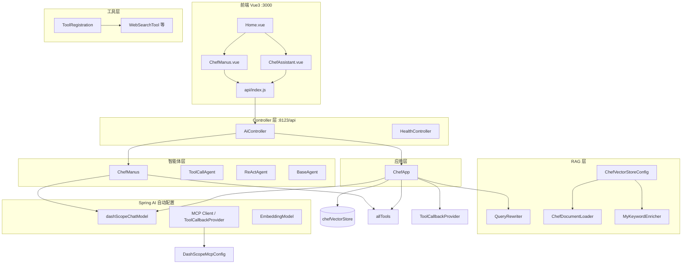
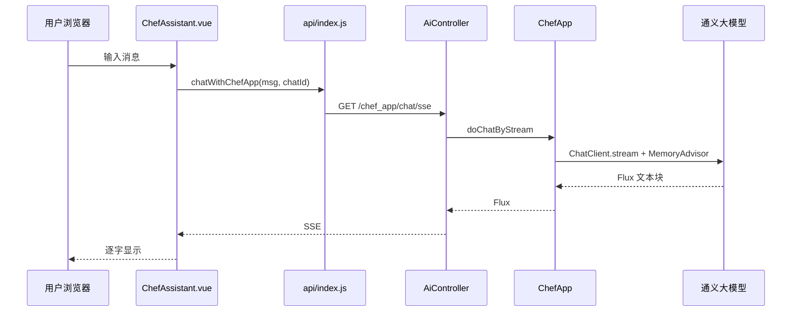
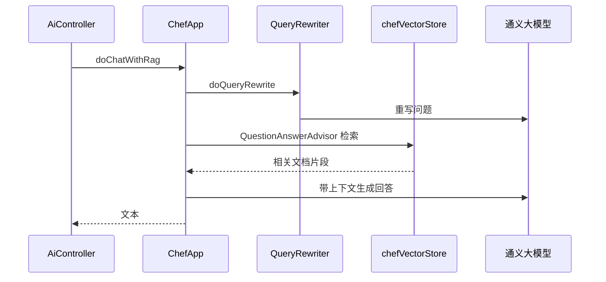
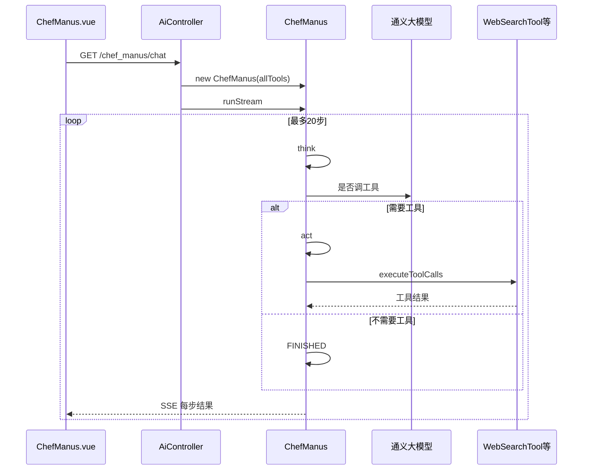

# 百味智厨 AI 助手 — 代码架构与类关系说明

> 本文档说明 **每一个目录、每一个类** 的职责、核心代码含义，以及类之间的 **调用 / 依赖 / 合作** 关系。  
> 配套简版目录说明见项目根目录 [README.md](../README.md)。

---

## 一、整体架构（三层 + 两条业务线）



### 两条业务线对比

| 业务线 | 入口 | 核心类 | 能力 |
|--------|------|--------|------|
| **烹饪助手** | `/chef_app/chat/*` | `ChefApp` | 对话 / RAG / Tools / MCP（由不同 HTTP 接口切换） |
| **智厨智能体** | `/chef_manus/chat` | `ChefManus` | ReAct 多步循环 + 本地 Java 工具（不走 RAG/MCP HTTP） |

---

## 二、启动与 Bean 依赖链

应用启动时，Spring 按大致顺序装配以下关键 Bean：

```
WuAiAgentApplication
  ├── dashScopeChatModel          ← spring-ai-alibaba 自动配置（读 api-key）
  ├── dashscopeEmbeddingModel     ← 向量化用（RAG）
  ├── ChefDocumentLoader          ← 读 document/*.md
  ├── MyKeywordEnricher           ← 依赖 ChatModel
  ├── chefVectorStore             ← ChefVectorStoreConfig 组装上述组件
  ├── QueryRewriter               ← 依赖 ChatModel
  ├── ToolRegistration.allTools   ← 7 个 @Tool 实例
  ├── ToolCallbackProvider        ← MCP 启用时由 Spring AI 注册（可选）
  ├── ChefApp                     ← 依赖 ChatModel + 注入 VectorStore、QueryRewriter、allTools
  ├── AiController                ← 注入 ChefApp、allTools、ChatModel
  └── DashScopeMcpConfig          ← MCP HTTP 请求加 Authorization
```

**注意：** `ChefManus` **不是** Spring Bean，每次请求在 `AiController` 里 `new ChefManus(...)`，用完即弃。

---

## 三、后端 — 按包说明

---

### 3.1 `WuAiAgentApplication.java`

| 项目 | 说明 |
|------|------|
| **职责** | Spring Boot 入口，`@SpringBootApplication` 触发组件扫描 `com.wu.aiagent` |
| **关系** | 不直接调用业务类；启动后由 Spring 创建所有 `@Component` / `@Configuration` |

---

### 3.2 包 `controller` — HTTP 入口

#### `AiController`

| 项目 | 说明 |
|------|------|
| **职责** | 把 HTTP 请求转发到 `ChefApp` 或 `ChefManus` |
| **依赖注入** | `ChefApp`、`ToolCallback[] allTools`、`ChatModel dashscopeChatModel` |

| 方法 | 调用链 | 说明 |
|------|--------|------|
| `doChatSync` | → `chefApp.doChat` | 同步全文返回 |
| `doChatSSE` | → `chefApp.doChatByStream` | **前端烹饪助手使用** |
| `doChatServerSentEvent` / `doChatSseEmitter` | → `doChatByStream` | 同能力的不同 SSE 写法 |
| `doChatWithRag` | → `chefApp.doChatWithRag` | 单独走 RAG |
| `doChatWithTools` | → `chefApp.doChatWithTools` | 单独走 Tool |
| `doChatWithMcp` | → `chefApp.doChatWithMcp` | 单独走 MCP |
| `doChatWithReport` | → `chefApp.doChatWithReport` | 结构化 JSON |
| `doChatWithChefManus` | `new ChefManus(allTools, chatModel)` → `runStream` | **前端智能体使用** |

**合作关系：** Controller 只做「路由」，不包含 AI 逻辑；与 `ChefApp` 是 **委托关系**。

#### `HealthController`

| 项目 | 说明 |
|------|------|
| **职责** | `GET /health` 返回 `"ok"` |
| **关系** | 独立，不依赖其他业务类 |

---

### 3.3 包 `app` — 核心业务

#### `ChefApp`

| 项目 | 说明 |
|------|------|
| **职责** | 封装一个带烹饪人设的 `ChatClient`，提供多种对话模式 |
| **类型** | `@Component` 单例 Bean |

**构造器（启动时执行一次）：**

```text
ChatModel (dashScopeChatModel)
  → MessageWindowChatMemory（内存，最多 20 条）
  → ChatClient.builder()
       .defaultSystem(SYSTEM_PROMPT)           // 烹饪助手人设
       .defaultAdvisors(
           MessageChatMemoryAdvisor,          // 多轮记忆
           MyLoggerAdvisor                    // 日志
       )
```

| 成员 / 方法 | 代码含义 | 调用的其他类 |
|-------------|----------|--------------|
| `SYSTEM_PROMPT` | 固定系统提示词，定义 AI 角色为烹饪助手 | — |
| `chatClient` | Spring AI 统一对话客户端 | `ChatModel`、`MyLoggerAdvisor` |
| `doChat` | `.call()` 一次性返回 | 仅 `chatClient` + `chatId` 记忆参数 |
| `doChatByStream` | `.stream().content()` 流式逐字返回 | 同上，供 SSE |
| `MealPlanReport` | Java `record`，结构化输出字段 | Spring AI `.entity()` 反序列化 |
| `doChatWithReport` | 让模型输出符合 record 结构的 JSON | `chatClient` |
| `chefVectorStore` | 注入 RAG 向量库 Bean | `ChefVectorStoreConfig` 产出 |
| `queryRewriter` | 注入查询重写器 | `QueryRewriter` |
| `doChatWithRag` | 先重写问题 → 再 `QuestionAnswerAdvisor` 检索 → 再生成回答 | `QueryRewriter`、`chefVectorStore`、`MyLoggerAdvisor`；详见 [`RAG流程说明.md`](./RAG流程说明.md) |
| `allTools` | 注入本地 Java 工具数组 | `ToolRegistration` |
| `doChatWithTools` | 单次对话中注册 `toolCallbacks(allTools)` | `WebSearchTool` 等 |
| `toolCallbackProvider` | MCP 远程工具提供者（可为 null） | Spring AI MCP 自动配置 |
| `doChatWithMcp` | 使用 MCP 工具（如 QwenImage）而非本地 Tool | `ToolCallbackProvider` |

**重要：** `doChatWithRag` / `doChatWithTools` / `doChatWithMcp` **互不自动组合**；要同时用需改代码或走 `ChefManus` 多步工具链。

---

### 3.4 包 `agent` — ReAct 智能体

#### 继承关系

```text
BaseAgent（抽象）
  └── ReActAgent（抽象：think + act）
        └── ToolCallAgent（实现 think/act + 工具执行）
              └── ChefManus（烹饪场景配置）
```

#### `AgentState`（枚举）

| 值 | 含义 |
|----|------|
| `IDLE` | 空闲，可接受新任务 |
| `RUNNING` | 正在执行 step 循环 |
| `FINISHED` | 正常结束 |
| `ERROR` | 异常结束 |

#### `BaseAgent`

| 成员 | 含义 |
|------|------|
| `systemPrompt` / `nextStepPrompt` | 系统指令 & 每步引导语 |
| `maxSteps` | 最多循环几次（ChefManus 设为 20） |
| `messageList` | 自行维护的对话历史（`List<Message>`） |
| `chatClient` | 子类构造时注入 |

| 方法 | 含义 | 子类关系 |
|------|------|----------|
| `run` | for 循环调用 `step()` 直到 FINISHED 或超步数 | 依赖子类 `step()` |
| `runStream` | 异步线程 + `SseEmitter` 每步推送结果 | 前端智能体页使用 |
| `step()` | **抽象**，由 `ReActAgent` 实现 | — |

#### `ReActAgent`

| 方法 | 含义 |
|------|------|
| `think()` | **抽象**：是否要做动作 |
| `act()` | **抽象**：执行动作 |
| `step()` | 先 `think()`，为 true 则 `act()`，否则返回「无需行动」 |

体现 **ReAct = Reasoning（思考）+ Acting（行动）** 模式。

#### `ToolCallAgent`

| 成员 | 含义 |
|------|------|
| `availableTools` | 构造传入，与 `ToolRegistration.allTools` 同一数组 |
| `toolCallingManager` | Spring AI 工具执行管理器 |
| `chatOptions` | `internalToolExecutionEnabled(false)`，工具由本类手动执行 |

| 方法 | 流程 | 合作类 |
|------|------|--------|
| `think()` | 1. 把 `nextStepPrompt` 加入 `messageList`<br>2. `chatClient` + `toolCallbacks` 问模型<br>3. 解析 `ToolCall` 列表；空则 FINISHED | `ChatClient`、`availableTools` |
| `act()` | `toolCallingManager.executeToolCalls` 执行工具，结果写回 `messageList`；若调用了 `doTerminate` 则 FINISHED | 各 `*Tool` 类 |
| `step()` | 覆盖父类：think 为 false 时返回 `lastDirectResponse`（纯聊天结束） | — |

#### `ChefManus`

| 项目 | 说明 |
|------|------|
| **职责** | 配置烹饪场景的 prompt、步数、专用 `ChatClient` |
| **创建方式** | `AiController` 每次请求 `new`，**非单例** |
| **依赖** | `super(allTools)` → `ToolCallAgent`；`ChatModel` 建 `ChatClient` |

**与 `ChefApp.doChatWithTools` 的区别：**

| 对比项 | ChefApp + tools | ChefManus |
|--------|-----------------|-----------|
| 调用方式 | 一次 HTTP，模型自主决定是否调工具 | 多轮 think→act 循环 |
| 记忆 | `MessageChatMemoryAdvisor` + chatId | 自维护 `messageList` |
| RAG / MCP | 有独立方法 | **默认未接入** |

---

### 3.5 包 `rag` — 知识库与检索

#### `ChefDocumentLoader`

| 项目 | 说明 |
|------|------|
| **职责** | 扫描 `classpath:document/*.md`，切成 Spring AI `Document` |
| **依赖** | `ResourcePatternResolver`（Spring 注入） |

| 方法 | 含义 |
|------|------|
| `loadMarkdowns()` | 遍历 md → `MarkdownDocumentReader` → 列表 |
| `extractCategory(filename)` | 从文件名取分类标签（如「快手」「健康」） |

**被谁调用：** 仅 `ChefVectorStoreConfig`（启动时一次）。

#### `MyKeywordEnricher`

| 项目 | 说明 |
|------|------|
| **职责** | 用 AI 为每个 Document 提取约 5 个关键词写入 metadata |
| **依赖** | `ChatModel`（`@Resource dashScopeChatModel`） |
| **被谁调用** | `ChefVectorStoreConfig.enrichDocuments` |

#### `ChefVectorStoreConfig`

| 项目 | 说明 |
|------|------|
| **职责** | 定义 Bean `chefVectorStore`（**PgVectorStore**，持久化到 PostgreSQL） |
| **流程** | `loadMarkdowns()` → `enrichDocuments()` → `VectorStoreDocumentWriter.addInBatches()` → `PgVectorStore.add()` |

```text
loadMarkdowns() → enrichDocuments() → vectorStore.add()（分批）→ 注入到 ChefApp
```

> 详细 RAG 教学说明见 [`RAG流程说明.md`](./RAG流程说明.md)（metadata 来源、QuestionAnswerAdvisor、入库/问答分步、常见误解）。

#### `VectorStoreDocumentWriter`

| 项目 | 说明 |
|------|------|
| **职责** | 分批调用 `vectorStore.add()`，适配百炼 Embedding 单次 batch ≤ 10 |
| **配置** | `rag.embedding-batch-size`（默认 10） |

#### `QueryRewriter`

| 项目 | 说明 |
|------|------|
| **职责** | 把用户口语问题改写成更适合检索的 query |
| **实现** | `RewriteQueryTransformer` + `ChatClient` |
| **被谁调用** | 仅 `ChefApp.doChatWithRag` 开头一步 |

---

### 3.6 包 `tools` — Tool Calling

#### `ToolRegistration`

| 项目 | 说明 |
|------|------|
| **职责** | `@Configuration`，注册 `ToolCallback[] allTools` Bean |
| **合作** | 读取 `search-api.api-key` 传给 `WebSearchTool` |

**被谁使用：**

- `ChefApp.doChatWithTools` → `chatClient.toolCallbacks(allTools)`
- `AiController.doChatWithChefManus` → `new ChefManus(allTools, ...)`

#### 各工具类（模式相同）

所有工具类使用 `@Tool` / `@ToolParam` 注解，由 `ToolCallbacks.from(...)` 转成 `ToolCallback`。

| 类 | 工具能力 | 外部依赖 |
|----|----------|----------|
| `WebSearchTool` | 百度搜索（SearchAPI） | `search-api.api-key` |
| `WebScrapingTool` | Jsoup 抓网页正文 | 目标 URL |
| `FileOperationTool` | 读写 `tmp/file/` | `FileConstant.FILE_SAVE_DIR` |
| `ResourceDownloadTool` | HTTP 下载文件 | Hutool |
| `TerminalOperationTool` | 执行系统命令 | 本机 OS |
| `PDFGenerationTool` | 生成 PDF | iText |
| `TerminateTool` | 方法名 `doTerminate`，通知智能体结束 | 无 |

**TerminateTool 与智能体的关系：** `ToolCallAgent.act()` 检测工具名 `doTerminate`，将 `state` 设为 `FINISHED`，跳出 `BaseAgent` 的 for 循环。

---

### 3.7 包 `config`

#### `CorsConfig`

| 项目 | 说明 |
|------|------|
| **职责** | 允许浏览器从 `localhost:3000` 跨域访问 `/api/**` |
| **关系** | 全局 WebMvc 配置，服务于前端 |

#### `DashScopeMcpConfig`

| 项目 | 说明 |
|------|------|
| **职责** | 注册 `McpSyncHttpClientRequestCustomizer`，给 MCP HTTP 请求加 `Authorization: Bearer {api-key}` |
| **关系** | 配合 `application.yml` 里 `streamable-http` 连接百炼 QwenImage；**不参与** `ChefApp` 本地 Tool |

---

### 3.8 包 `advisor`

#### `MyLoggerAdvisor`

| 项目 | 说明 |
|------|------|
| **职责** | 实现 `CallAdvisor` + `StreamAdvisor`，在 AI 调用前后打日志 |
| **使用位置** | `ChefApp` 默认 Advisor；`ChefApp.doChatWithRag/Tools/Mcp` 额外挂一次；`ChefManus` 的 ChatClient |

**关系：** 挂在 `ChatClient` 链路上，属于 **横切增强**，不改变业务返回值。

---

### 3.9 包 `constant`

#### `FileConstant`

| 项目 | 说明 |
|------|------|
| **职责** | 定义 `FILE_SAVE_DIR = {user.dir}/tmp` |
| **被谁用** | `FileOperationTool` |

---

## 四、配置文件说明

| 文件 | 作用 | 影响哪些类 |
|------|------|------------|
| `application.yml` | 端口、context-path、模型名、MCP 地址、`initialized: false` | 全局 |
| `application-local.yml` | 真实 api-key（gitignore） | `ChatModel`、MCP、`WebSearchTool` |
| `application-test.yml` | 测试时关闭 MCP | 测试类 |
| `document/*.md` | RAG 原文 | `ChefDocumentLoader` |

---

## 五、前端 — 按目录说明

### 5.1 调用关系总览

```text
main.js
  └── App.vue
        └── router
              ├── Home.vue
              ├── ChefAssistant.vue  ──→ api/chatWithChefApp  ──→ GET /api/ai/chef_app/chat/sse
              └── ChefManus.vue      ──→ api/chatWithChefManus ──→ GET /api/ai/chef_manus/chat
```

### 5.2 `api/index.js`

| 函数 | 请求地址 | 对应后端 |
|------|----------|----------|
| `connectSSE` | 封装 `EventSource` | 通用 |
| `chatWithChefApp` | `/ai/chef_app/chat/sse?message=&chatId=` | `AiController.doChatSSE` |
| `chatWithChefManus` | `/ai/chef_manus/chat?message=` | `AiController.doChatWithChefManus` |

`API_BASE_URL`：开发环境写死 `http://localhost:8123/api`，与 `application.yml` 的 `8123` + `/api` 对应。

### 5.3 `views/Home.vue`

| 项目 | 说明 |
|------|------|
| **职责** | 首页两个入口卡片 |
| **路由** | `/` → 跳转 `/chef-assistant` 或 `/chef-manus` |

### 5.4 `views/ChefAssistant.vue`

| 逻辑 | 说明 |
|------|------|
| `chatId` | 页面加载时生成 `chef_xxx`，传给后端作多轮记忆 key |
| `sendMessage` | 用户消息入列表 → `chatWithChefApp` SSE → 增量拼到 AI 气泡 |
| **未调用** | rag / tools / mcp 接口 |

**合作组件：** `ChatRoom`（展示）、`AppFooter`。

### 5.5 `views/ChefManus.vue`

| 逻辑 | 说明 |
|------|------|
| `sendMessage` | `chatWithChefManus` SSE，按步追加内容 |
| **无 chatId** | 智能体侧用 `BaseAgent.messageList` 单次请求内维护 |

### 5.6 `components/ChatRoom.vue`

| 项目 | 说明 |
|------|------|
| **职责** | 通用聊天 UI：消息列表、输入框、发送 |
| **Props** | `messages`、`connectionStatus`、`aiType`（头像样式） |
| **事件** | `@send-message` 向父组件抛用户输入 |

**关系：** 被两个 View 复用，**不包含** API 逻辑。

### 5.7 `components/AiAvatarFallback.vue` / `AppFooter.vue`

纯 UI，无后端调用。

### 5.8 `router/index.js`

定义三条路由与页面标题 `meta.title`。

---

## 六、典型请求时序

### 6.1 烹饪助手 — 流式对话



### 6.2 RAG 菜谱问答（Postman / 测试，前端未接）



### 6.3 智厨智能体 — ReAct + 工具



---

## 七、测试类与其他类的关系

| 测试类 | 测谁 | 关系 |
|--------|------|------|
| `WuAiAgentApplicationTests` | 整个容器 | 无业务调用 |
| `HealthControllerTest` | `HealthController` | MockMvc |
| `ChefDocumentLoaderTest` | `ChefDocumentLoader` | 直接调 `loadMarkdowns` |
| `ChefAppTest` | `ChefApp` 各方法 | `@Resource` 注入，真调 API |
| `ChefManusTest` | `ChefManus.run` | 手动 new，真调 API |

---

## 八、扩展时改哪里（速查）

| 想实现的功能 | 建议修改 |
|--------------|----------|
| 前端增加 RAG 模式 | `ChefAssistant.vue` + `api/index.js` 调 `/chef_app/chat/rag` |
| 前端合并工具能力 | 改调 `/chef_app/chat/tools` 或继续用 Manus 页 |
| 智能体接入 MCP | 改 `ChefManus` 构造，注入 `ToolCallbackProvider` |
| 换 PgVector | 新增 Config，改 `ChefApp` 注入的 `VectorStore` |
| 关闭 MCP 避免启动失败 | `application.yml` → `mcp.client.enabled: false` |
| 换烹饪人设 | 改 `ChefApp.SYSTEM_PROMPT` |
| 增加菜谱文档 | `resources/document/` 加 `.md` 后重启 |

---

## 九、文档维护

- 项目结构简表：[README.md](../README.md)  
- 本文档路径：`docs/代码架构与类关系说明.md`  
- 代码变更后请同步更新「调用链」与「Bean 依赖」两节。
